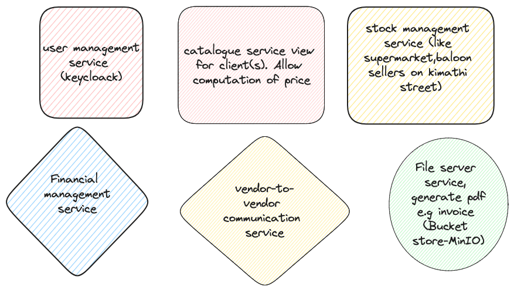
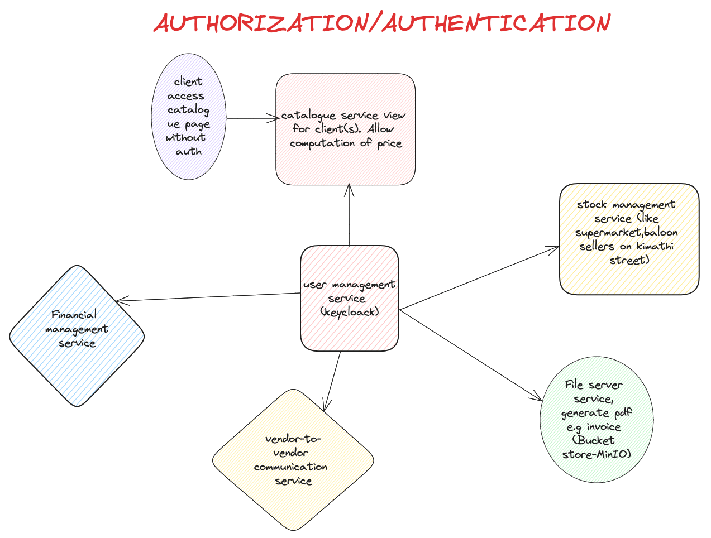
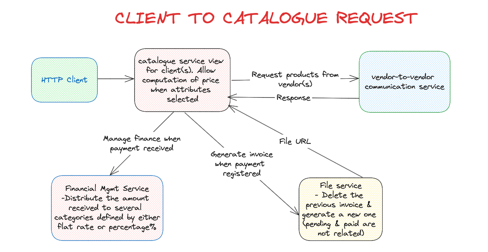
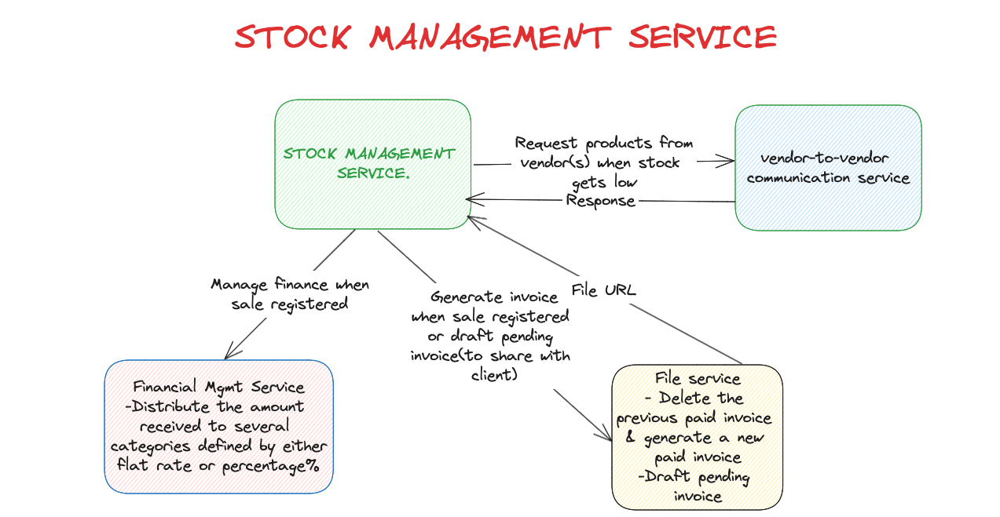
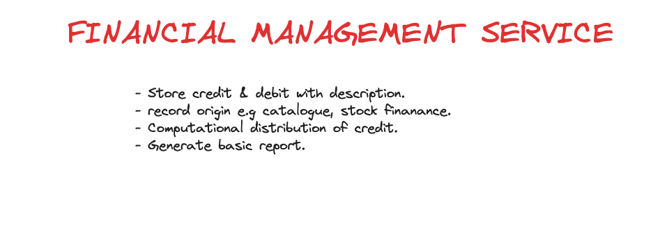
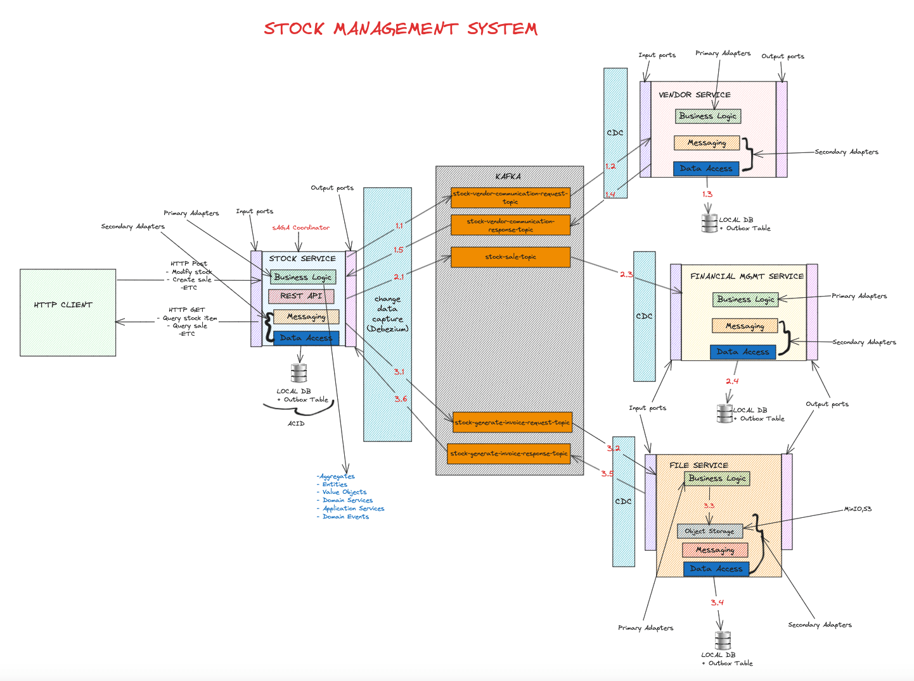
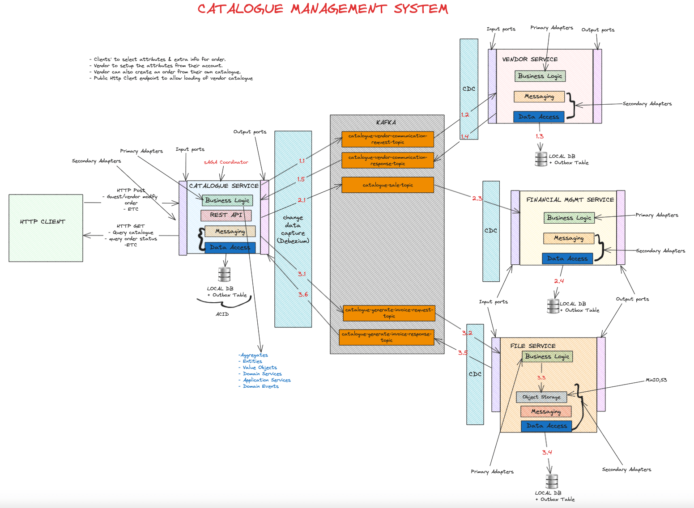

# Vendor Management Service
Allow vendors to register and manage their products. Allow customers to view and purchase products from vendors.

## Features
- Infrastructure
  - [x] Docker
  - [x] Cyberark Conjur
  - [x] Kafka
  - [x] Keycloak
  - [x] Database
- Common modules
  - [x] Authentication
  - [x] Authorization
  - [x] Logging
  - [x] Monitoring
  - [x] Tracing
- Microservices
  - [x] User service
  - [x] Stock service

### How to run
1. Clone the repository
2. Navigate to `infrastructure/docker-compose` directory
3. Run `docker-compose -f common.yml -f conjur.yml up`
4. Run `docker-compose -f common.yml -f postgres.yml up`
5. Run `docker-compose -f common.yml -f keycloak.yml up`
6. Run `./start-up.sh`
7. To shutdown `./shutdown.sh`
8. Run user service, navigate to `user-service/user-container`
9. Run stock service, navigate to `stock-service/user-container`

### Microservices

### Authorization/Authentication

### Client To Catalogue

### Stock To Other Services

### Financial Service

### Stock Service

### Catalogue Service

